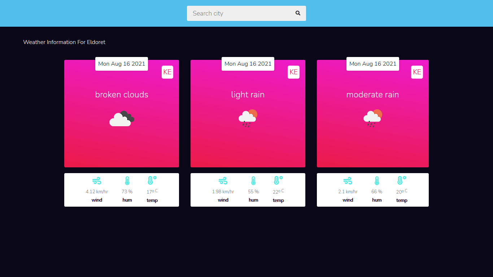

## Weather app


[Live Demo](https://weather-app-d8bxyiakg-oliverwanyonyi.vercel.app/)

### description

weather app built with javascript to exercise fetching data from third party apis asynchronously with javascript and using it to displaying weather information about a city

```javascript
fetch(url)
.then(res=> res.json())
.then(data => console.log(data)).catch(err=>console.log(err))
```

### features

- search weather information of a city
- error handling incase the user query is invalid
- i'm yet to implement local storage to persist user data.

### Built with

- html
- css
- javascript
- [openweather](https://openweathermap.org) Api
